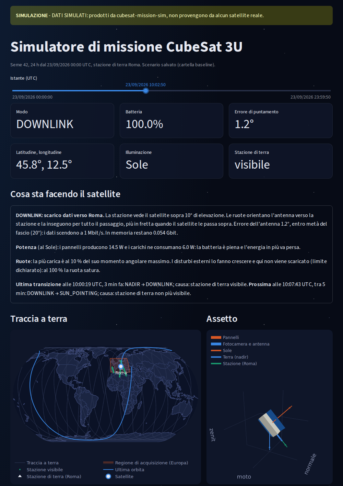
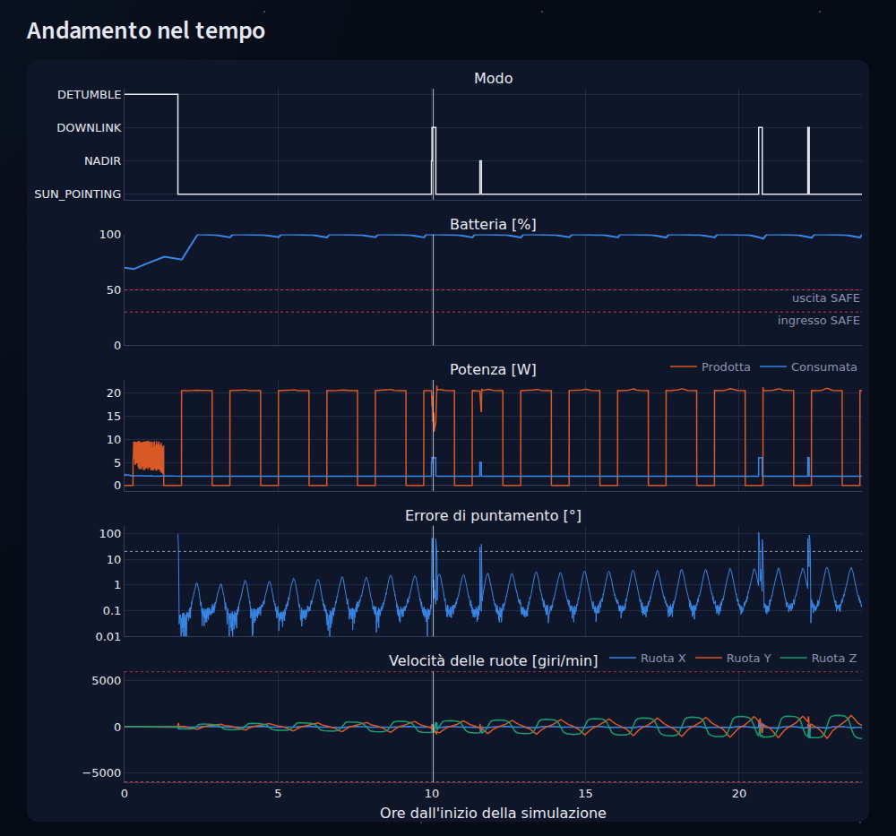
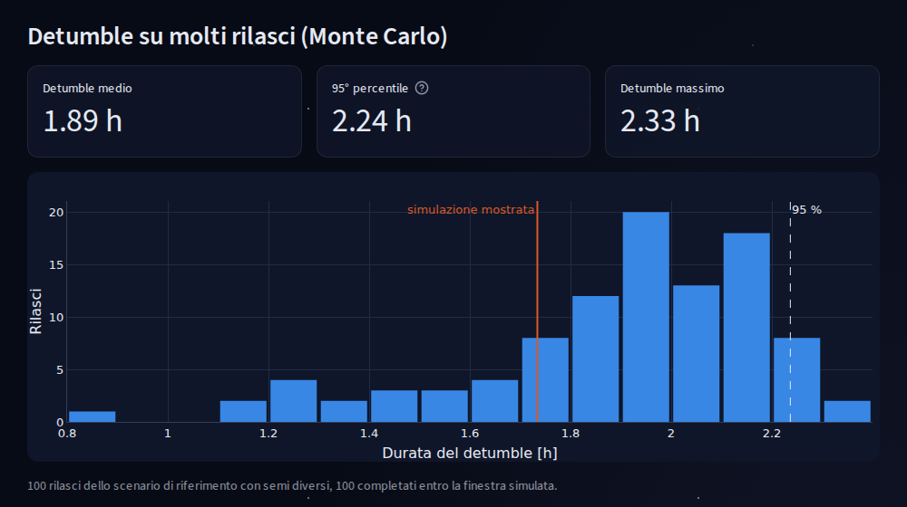

# cubesat-mission-sim

Simulatore di missione per un CubeSat 3U in orbita bassa eliosincrona: controllo
d'assetto, bilancio di energia e di dati e gestore dei modi di bordo in un'unica
simulazione, con una dashboard Streamlit per riprodurre e analizzare la
giornata di volo.

> **Tutti i dati prodotti da questo progetto sono simulati.** Non provengono da
> alcun satellite reale e non vanno usati per operazioni di volo.



## Il problema

In un piccolo satellite i sottosistemi non si possono studiare uno alla volta.
L'assetto decide quanta energia producono i pannelli e se l'antenna vede la
stazione di terra; il controllo d'assetto consuma energia; puntare la
fotocamera verso la Terra toglie il Sole ai pannelli. Il simulatore mette
insieme questi legami e mostra dove si trovano i veri vincoli della missione.

## Risultati principali

Scenario di riferimento: 24 ore dal rilascio, orbita a 500 km, stazione di
terra a Roma (analisi completa in [`docs/results.md`](docs/results.md)).

- **Detumble**: la rotazione iniziale di 10 °/s si smorza con i soli
  magnetorquer in 1,73 h. Su 100 rilasci casuali (Monte Carlo) il 95 % finisce
  entro **2,24 h**: è il valore da usare in progetto.
- **L'energia non è il vincolo**: circa 20,6 Wh prodotti e 3,2 Wh consumati per
  orbita. Puntare la Terra invece del Sole costa 4,6 Wh per orbita (22 %).
- **Il vincolo sono i dati**: la geometria dei passaggi limita le acquisizioni
  a 0,49 Gbit al giorno, scaricati tutti.
- **Il controllo d'assetto decide quanti dati scendono**: l'antenna punta la
  stazione entro metà fascio per il 72 % del tempo di visibilità; il resto è
  la manovra iniziale verso Roma.
- **Batteria**: 2,45 Wh basterebbero a evitare il modo SAFE; i 40 Wh scelti
  sono giustificati dalla profondità di scarica, non dal bilancio della
  giornata.
- **Due difetti di sistema** trovati solo nella missione completa e corretti:
  le manovre di grande angolo riportavano il satellite in DETUMBLE, e il
  riferimento del DOWNLINK aveva una singolarità nei passaggi notturni.



## Il modello

| Parte | Modello |
|---|---|
| Orbita | Circolare, 500 km, eliosincrona (97,4°), nodo discendente alle 10:30 |
| Ambiente | Sole analitico, eclissi con ombra cilindrica, campo magnetico come dipolo inclinato, stazione di terra con elevazione minima di 10° |
| Assetto | Quaternioni, equazioni di Eulero con le ruote di reazione, RK4 a passo fisso di 0,25 s; disturbi da gradiente gravitazionale e dipolo residuo |
| Sensori | Assetto, velocità angolare e campo magnetico con rumore gaussiano; il controllo vede solo le misure, mai lo stato vero |
| Controllo (1 Hz) | B-dot con i magnetorquer per il detumble; PD sul quaternione con le ruote, guadagni ricavati da banda e smorzamento, limite di velocità nelle grandi manovre |
| Modi | SAFE, DETUMBLE, DOWNLINK, NADIR, SUN_POINTING, in ordine di priorità, con isteresi, tempo di conferma e registro delle cause |
| Energia e dati | Pannelli in funzione dell'assetto, batteria con rendimenti, consumi per sottosistema, memoria di bordo, scarico solo con l'antenna entro metà fascio |

Ogni valore numerico è giustificato in [`docs/assumptions.md`](docs/assumptions.md),
insieme ai limiti dichiarati del modello.

## Architettura

Pacchetto Python `cubesat_sim`, organizzato in sottopacchetti con dipendenze a
senso unico. Un test architetturale legge gli import di ogni file e fa
rispettare le regole.

| Sottopacchetto | Contenuto | Può importare |
|---|---|---|
| `core` | Configurazione (TOML validato con pydantic), quaternioni e vettori, salvataggio dei risultati | — |
| `environment` | Orbita, Sole, eclissi, campo magnetico, stazione di terra | `core` |
| `attitude` | Dinamica, disturbi, sensori, attuatori, controllori, assetti di riferimento | `core` |
| `resources` | Pannelli, batteria, consumi, memoria e scarico dei dati | `core` |
| `modes` | Gestore dei modi | `core` |
| `simulation` | Ciclo di simulazione e riga di comando | `core` e i quattro precedenti |
| `analysis` | Metriche, studi di compromesso, Monte Carlo | tutti tranne `dashboard` |
| `dashboard` | Streamlit e plotly, sola visualizzazione | tutti |

## La dashboard

Una barra del tempo riproduce le 24 ore simulate, istante per istante:

- sei riquadri con modo, batteria, errore di puntamento, posizione,
  illuminazione e visibilità della stazione;
- un testo che spiega che cosa sta facendo il satellite in quell'istante, con
  i numeri, e quali sono l'ultima e la prossima transizione di modo con la
  loro causa;
- traccia a terra su mappa, assetto 3D del satellite nel riferimento orbitale e
  andamento nel tempo di modi, batteria, potenza, errore di puntamento e
  velocità delle ruote;
- metriche della missione, studi di compromesso e statistica Monte Carlo del
  detumble.

Sotto ogni grafico un riquadro apribile spiega come leggerlo. Dalla barra
laterale si può lanciare una nuova simulazione breve (fino a 6 ore) cambiando
la capacità della batteria e la rotazione al rilascio.

## Verifiche

308 test automatici con pytest, dalla fisica dei singoli modelli alla missione
completa e alla dashboard. Alcuni esempi:

- periodo orbitale, inclinazione eliosincrona e durata dell'eclissi confrontati
  con le formule analitiche;
- in rotazione libera momento angolare ed energia si conservano e il
  quaternione resta di norma 1;
- il B-dot riduce la velocità angolare; il PD si assesta nel tempo previsto dai
  guadagni;
- il bilancio energetico si chiude sull'intera simulazione;
- con lo stesso seme due simulazioni danno file identici byte per byte.

Il codice passa `ruff` (stile e qualità) e `mypy` in modalità strict (tipi).

## Uso

Requisiti: Python 3.12 o successivo e [uv](https://docs.astral.sh/uv/). Dalla
cartella del progetto:

```bash
uv sync                                         # ambiente e dipendenze
uv run python -m streamlit run src/cubesat_sim/dashboard/app.py
```

La dashboard legge i risultati già salvati in `results/`. Per ricalcolarli:

```bash
uv run python -m cubesat_sim.simulation config/baseline.toml results/baseline
uv run python -m cubesat_sim.analysis results/baseline
uv run python -m cubesat_sim.analysis.monte_carlo config/baseline.toml results/monte_carlo
```

La simulazione di 24 ore richiede circa 3 minuti; il Monte Carlo lancia 100
corse di 3 ore in parallelo su tutti i core. Per i controlli di qualità:

```bash
uv run ruff format .
uv run ruff check .
uv run python -m mypy
uv run python -m pytest
```



## Struttura

```text
.streamlit/config.toml   tema scuro della dashboard
config/baseline.toml     scenario di riferimento
docs/assumptions.md      ipotesi, valori, verifiche e limiti del modello
docs/results.md          risultati e analisi dello scenario
docs/images/             immagini di questo README
results/baseline/        simulazione di 24 h (CSV, JSON, analisi)
results/monte_carlo/     100 rilasci del Monte Carlo
src/cubesat_sim/         codice del simulatore e della dashboard
tests/                   test automatici
```

## Limiti e sviluppi

I limiti del modello sono dichiarati in
[`docs/assumptions.md`](docs/assumptions.md) (sezione 15). Tra le estensioni
possibili, elencate in [`docs/results.md`](docs/results.md) (sezione 12):
scarico del momento delle ruote, stima dell'assetto con filtro di Kalman,
orbita SGP4 da dati reali, Monte Carlo esteso ai parametri fisici.

## Come è stato sviluppato

Il codice, i test e la documentazione di questo repository sono stati scritti
da un assistente di intelligenza artificiale, in una
conversazione guidata passo per passo. Chi pubblica il repository ha fissato
obiettivi, requisiti e ipotesi di missione, ha eseguito ogni passo sul proprio
computer e ne ha controllato l'esito con i test e i controlli di qualità
descritti sopra; non rivendica la paternità del codice.

Il progetto ha scopo dimostrativo ed è fornito così com'è, senza garanzie di
alcun tipo.
